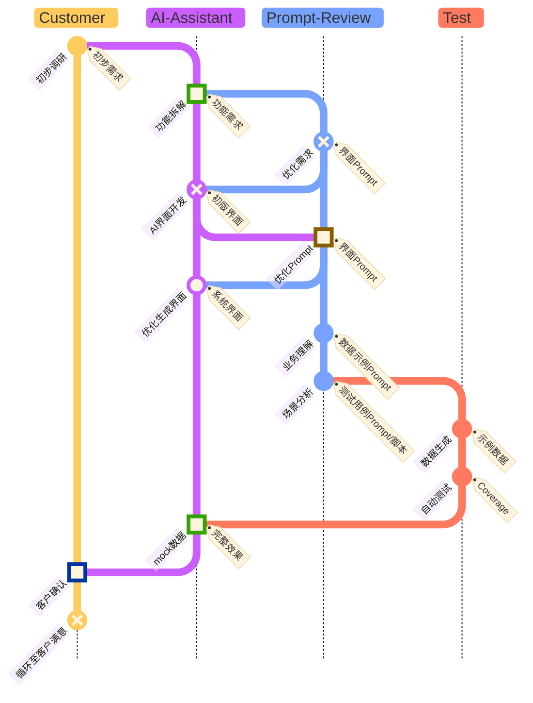

# 提示工程规划

已知条件是一份简单的 `客户需求概要` 文档（例如 `docs/requirements/business/original_requirement.md`），在已知条件下，通过拆解工作步骤，建立 `提示工程` 的 `prompt` 模板。尝试通过让AI运行，实现项目的自动化构建。

## 工程流程简化

在AI技术加持助力下，将项目构建流程进行简化。例如：

### 1. **需求文档**规格调整

    原本的需求文档将围绕人的阅读习惯进行编写，主要在于让阅读者能够清晰地理解需求，并将业务拆解为功能。

**在AI技术加持下，需求文档将围绕AI的阅读习惯进行编写，主要在于让AI能够在清晰地理解需求的前提下，通过分步骤地将需求转化为界面和可执行的代码。**

### 2. 去除**原型**这一概念，改称为**界面**

    原型的存在原本是由于开发界面的工作量太大，客户的需求又将多变，所以需要先做出原型，根据原型与客户沟通，再根据沟通结果调整原型，再与客户沟通，再调整原型，如此反复，直到客户满意。在客户满意之后才投入开发，极大的缩减前期成本。

**上了AI之后，界面设计可以由AI完成，极大提高效率，本身成本不高，所以不需要再单独设计原型与客户确认，直接由AI生成界面即可。**

## 主要流程

### 1. 使用界面来确认需求

原本使用文字确认需求存在大量二义性，难以准确理解客户需求，所以需要使用界面来确认需求。所以，高效生成界面，是实现项目自动化的关键。

**基本流程**

**为了高效地生成界面，这里需要重点关注的几个可复用经验：**

- 使用什么样的技术基础（稳定、美观）
  - 稳定：生成的界面是后续项目前端可直接使用的，所以需要考虑稳定性，避免使用过于复杂的技术，避免使用过于复杂的技术，使变更调整容易进行；
  - 美观：生成的界面需要美观，符合现代审美，符合行业标准，符合客户需求。

- 在此技术基础之上，生成界面的需求格式（可控、可复用）
  - 可控：生成的界面需要可控，能够有效避免AI理解的偏差，生成结果不发生偏差；
  - 可复用：生成的界面的Prompt要能够被复用，避免重复劳动，提高效率。

- 为在客户面前不演示失败，需要生成测试用例（覆盖率）
  - 生成测试用例、示例数据的Prompt要能够被复用，尤其是如何判定测试用例的数量、测试边界、测试数据等。

> 在`Prompt-Review`的过程中，补充的需求内容、背景信息等都添加到`docs/requirements/business/additional_requirements.md`中。

