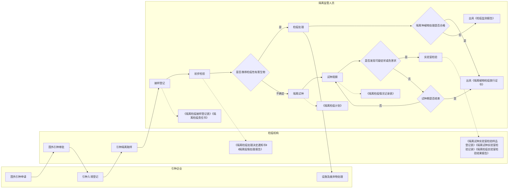

# 检疫隔离试种信息管理系统

本文是与客户沟通后，整理的初步需求概要文档。

创建日期：2025-02-11

## 主流程

**主流程说明**

1. 企业用户向植物检疫机构提交国外引种申请；

2. 检疫机构进行国外引种审批（分部级审批和省级审批），如果需要进行隔离试种，在审批意见中给出是否需要隔离试种、隔离试种场所、隔离试种数量等审批意见（审批单）；

    2.1 隔离试种场所由系统管理员统一管理，登记信息见《隔离试种场所信息登记表》

3. 企业将种苗从国外引到国内后，当地省级检疫机构按照审批单上的隔离试种要求进行取样，同时在系统中填写并打印《隔离检疫抽样记录表》，抽样人和企业用户签字确认，将抽样记录表与样品一起寄送到指定的隔离试种场所；
4. 隔离试种监管人员收到样品后，使用移动端扫描《隔离检疫抽样记录表》上的二维码，填写《隔离检疫接样登记表》，进行接样登记；
5. 隔离试种监管人员使用标签打印机打印《隔离试种样品标签》，对样品进行标识；
6. 隔离试种监管人员对样品进行初步检验，根据初步检验结果决定是否进行隔离检疫；
    
    6.1 如果确认携带检疫性有害生物，则出具《隔离检疫处理决定通知书》和《隔离疫情处理报告》，提供给企业，并进行设施及废弃物处理；
    
    6.2 如果无法确认是否携带检疫性有害生物，则进行隔离试种；

7. 隔离试种开始后，隔离试种监管人员制定《隔离试种计划》（需确认实际工作中是否制定隔离试种计划），隔离试种监管人员将《隔离试种样品标签》粘贴到隔离温室种植区域的显著位置，便于后续扫码查询，记录观察数据；

8. 隔离试种过程中，记录植物生长情况，进行症状观察与检测，并填写《隔离检疫情况记录表》；

    8.1 如果隔离试种期结束仍未发现可疑症状或危害状，隔离试种场所出具《隔离植物检疫放行证书》，检疫机构提供《进境植物繁殖材料入境后疫情监测报告》；
    
    8.2 如果发现有可疑症状或危害状，则进行实验室检验，实验室检验过程中填写《隔离试种实验室检验样品登记表》、《隔离试种实验室检验记录》和《隔离检疫实验室检验结果报告》，根据实验室检验结果确定继续隔离试种观察或者进行疫情处置
        
        8.2.1 实验室检验未发现检疫性有害生物，继续进行隔离试种观察；
        
        8.2.2 实验室检验确认发现检疫性有害生物，则出具《隔离检疫处理决定通知书》和《隔离疫情处理报告》，提供给企业，并进行设施及废弃物处理；
        
            8.2.2.1 隔离监管人员对植物进行检疫处理，处理合格的，隔离场所出具《隔离植物检疫放行证书》，检疫机构提供《进境植物繁殖材料入境后疫情监测报告》；
        
            8.2.2.2 处理不合格的，仅由检疫机构提供《进境植物繁殖材料入境后疫情监测报告》；

## 流程表单

### 1、隔离试种场所登记信息表

| 字段名称 | 字段说明 |
|---------|---------|
| 名称 | |
| 类型 | 国家隔离场/区域隔离场/地方隔离场/企业自建隔离场 |
| 主管植物检疫机构 | 从部级、省级植物检疫机构中选择 |
| 地址 | 省市县、详细地址、经纬度 |
| 负责人 | |
| 联系方式 | |

### 2、隔离检疫抽样记录表

| 字段名称 | 字段说明 |
|---------|---------|
| 企业名称 | 从审批单自动带出 |
| 植物名称 | 从审批单自动带出 |
| 审批单号 | 从审批单自动带出 |
| 抽样单位 | 当前登录人所在检疫机构 |
| 抽样人 | 当前登录人 |
| 抽样日期 | 默认当前日期，可修改 |
| 抽样数量 | 从审批单自动带出，可修改 |

### 3、隔离检疫接样登记表

<h5 style="text-align:center;font-weight:bold;margin-bottom:20px">隔离检疫接样登记表</h5>
<table style="width:100%;border-collapse:collapse;margin-bottom:20px">
<tr><td style="border:1px solid black;padding:8px;width:50%">登记号：</td><td style="border:1px solid black;padding:8px;width:50%">货主：</td></tr>
<tr><td style="border:1px solid black;padding:8px">地址：</td><td style="border:1px solid black;padding:8px">邮政编码：</td></tr>
<tr><td style="border:1px solid black;padding:8px">联系人：</td><td style="border:1px solid black;padding:8px">电话：</td></tr>
<tr><td style="border:1px solid black;padding:8px">传真：</td><td style="border:1px solid black;padding:8px">电子信箱：</td></tr>
<tr><td style="border:1px solid black;padding:8px">植物中名：</td><td style="border:1px solid black;padding:8px">植物学名：</td></tr>
<tr><td style="border:1px solid black;padding:8px">品种名称：</td><td style="border:1px solid black;padding:8px">植物部位：</td></tr>
<tr><td style="border:1px solid black;padding:8px">种苗来源国：</td><td style="border:1px solid black;padding:8px">入境口岸：</td></tr>
<tr><td style="border:1px solid black;padding:8px">入境数量：</td><td style="border:1px solid black;padding:8px">入境日期：</td></tr>
<tr><td style="border:1px solid black;padding:8px">送检数量：</td><td style="border:1px solid black;padding:8px">接样日期：</td></tr>
<tr><td style="border:1px solid black;padding:8px">货值：</td><td style="border:1px solid black;padding:8px">包装材料：</td></tr>
<tr><td style="border:1px solid black;padding:8px" colspan="2">引进种子、苗木检疫审批编号：</td></tr>
<tr><td style="border:1px solid black;padding:8px" colspan="2">原产国植物检疫证书号：</td></tr>
<tr><td style="border:1px solid black;padding:8px" colspan="2">口岸放行通知单或检疫调离通知单号：</td></tr>
<tr><td style="border:1px solid black;padding:8px" colspan="2">发现新的有害生物后是否需要作风险分析报告：<input type="checkbox" id="yes"> 是<input type="checkbox" id="no"> 否</td></tr>
<tr><td style="border:1px solid black;padding:8px" colspan="2">
附件：<ul style="list-style-type:none;padding-left:20px;margin:0"><li>1. (引进种子、苗木检疫审批单)复印件；</li><li>2. (有害生物风险分析报告)；</li><li>3. 出口国(植物检疫证书)或产地检疫证明复印件；</li><li>4. (口岸放行通知单)或(检疫调离通知单)复印件。</li></ul>
</td></tr>
<tr><td style="border:1px solid black;padding:8px" colspan="2">
货主(签名、盖章)：接样人(签名)：
</td></tr>
<tr><td style="border:1px solid black;padding:8px;text-align:right" colspan="2">年 月 日</td></tr>
</table>

**登记号格式**：

《隔离检疫接样登记表》登记号编写格式为：隔离场所在省(直辖市、自治区)名称汉语拼音的一个字母(大写) + 样品进场年份数字 + 该年份进场样品批次数(三位)。如：北京隔离场2006年进场的第23批样品，登记号为：BJ2006023。

### 4、隔离检疫实验室检验结果报告

<h5 style="text-align:center;font-weight:bold;margin-bottom:20px">隔离检疫实验室检验结果报告</h5>
<table style="width:100%;border-collapse:collapse;margin-bottom:20px">
<tr><td style="border:1px solid black;padding:8px;width:50%">登记号：</td><td style="border:1px solid black;padding:8px;width:50%">审批编号：</td></tr>
<tr><td style="border:1px solid black;padding:8px">植物中名：</td><td style="border:1px solid black;padding:8px">样品编号：</td></tr>
<tr><td style="border:1px solid black;padding:8px">取样部位：</td><td style="border:1px solid black;padding:8px">取样数量：</td></tr>
<tr><td style="border:1px solid black;padding:8px">取样时间：</td><td style="border:1px solid black;padding:8px">取样人：</td></tr>
<tr><td style="border:1px solid black;padding:8px">送检时间：</td><td style="border:1px solid black;padding:8px">检验时间：</td></tr>
<tr><td style="border:1px solid black;padding:8px" colspan="2">检验方法：</td></tr>
<tr><td style="border:1px solid black;padding:8px;height:300px" colspan="2">检验结果：</td></tr>
<tr><td style="border:1px solid black;padding:8px" colspan="2">
检验员(签名)：实验室负责人：
</td></tr>
<tr><td style="border:1px solid black;padding:8px;text-align:right" colspan="2">年 月 日</td></tr>
</table>

### 5、隔离检疫处理决定通知书

    <h5 style="text-align: center;">E.1 隔离检疫处理决定通知书</h2>
    
编号：_______________

    

        
_____________（货主）：

        

            你单位从（原产国）引进的（隔离种植物）种子/种球/苗木_____________克（株），在我场进行隔离检疫，登记号（登记号），审批编号（审批编号）。检验结果如下：
        

        
1. 初检发现如下有害生物：

        

        
2. 隔离检疫期间发现如下有害生物：

        

        

            根据该批次隔离种植物《有害生物风险分析报告》中提出的风险管理方案和《植物检疫条例》及其《实施细则》及所签协议有关规定，对该批次隔离种植物进行如下检疫处理：
        

        

            
□ 销毁

            
□ 除害

            
□ 脱毒

        

        

            货单位对销毁决定若有疑义，有权在5个工作日内向我场提出复检申请，复检期限为20个工作日，复检费用由货单位承担。
        

    

    

        
隔离检疫场（盖章）

        
货主（签字、盖章）

    
    
    

        
专职检疫员（签字）

    

    

        ________年________月________日
    

### 6、隔离检疫处理报告

<h2 style="text-align:center;font-weight:bold;margin-bottom:20px">隔离检疫处理报告</h2>
<table style="width:100%;border-collapse:collapse;margin-bottom:20px">
<tr><td style="border:1px solid black;padding:8px;width:50%">登记号：</td><td style="border:1px solid black;padding:8px;width:50%">审批编号：</td></tr>
<tr><td style="border:1px solid black;padding:8px">货主：</td><td style="border:1px solid black;padding:8px">植物中名：</td></tr>
<tr><td style="border:1px solid black;padding:8px" colspan="2">《隔离检疫处理决定通知书》编号：</td></tr>
<tr><td style="border:1px solid black;padding:8px">处理数量：</td><td style="border:1px solid black;padding:8px">处理时间：</td></tr>
<tr><td style="border:1px solid black;padding:8px;height:150px" colspan="2">检验发现有害生物：</td></tr>
<tr><td style="border:1px solid black;padding:8px;height:150px" colspan="2">处理方法：</td></tr>
<tr><td style="border:1px solid black;padding:8px;height:150px" colspan="2">处理结果：</td></tr>
<tr><td style="border:1px solid black;padding:8px" colspan="2">

隔离检疫场(盖章)

专职检疫员(签字)

货主(签字、盖章)

年 月 日

</td></tr>
</table>

### 7、进境植物繁殖材料入境后疫情监测报告

<h2 style="text-align:center;font-weight:bold;margin-bottom:20px">进境植物繁殖材料入境后疫情监测报告</h2>

登记号：

<table style="width:100%;border-collapse:collapse;margin-bottom:20px">
<tr>
<td style="border:1px solid black;padding:8px;width:33%">货主：</td>
<td style="border:1px solid black;padding:8px;width:33%">联系人：</td>
<td style="border:1px solid black;padding:8px;width:34%">联系电话：</td>
</tr>
<tr>
<td style="border:1px solid black;padding:8px">审批单位：</td>
<td style="border:1px solid black;padding:8px">审批编号：</td>
<td style="border:1px solid black;padding:8px">审批数量：</td>
</tr>
<tr>
<td style="border:1px solid black;padding:8px">植物名称：</td>
<td style="border:1px solid black;padding:8px" colspan="2">品种名称：</td>
</tr>
<tr>
<td style="border:1px solid black;padding:8px">种苗来源国(地区)：</td>
<td style="border:1px solid black;padding:8px" colspan="2">引进数量：</td>
</tr>
<tr>
<td style="border:1px solid black;padding:8px">种植地点：</td>
<td style="border:1px solid black;padding:8px">种植面积：</td>
<td style="border:1px solid black;padding:8px">种植日期：</td>
</tr>
<tr>
<td style="border:1px solid black;padding:8px;height:100px" colspan="3">应检有害生物名单：(中文名和学名)</td>
</tr>
<tr>
<td style="border:1px solid black;padding:8px;height:100px" colspan="3">监测及检验方法：</td>
</tr>
<tr>
<td style="border:1px solid black;padding:8px" colspan="3">疫情监测结果： 
1. 发现危险性有害生物及为害程度：  
2. 发现可疑有害生物及为害程度：</td>
</tr>
<tr>
<td style="border:1px solid black;padding:8px" colspan="3">处理意见： 
<input type="checkbox"> 1. 符合国家检疫要求，入境后检疫合格。 
<input type="checkbox"> 2. 发现危险性有害生物，经处理后继续检疫监测 年，不宜再次从境外引进。 
<input type="checkbox"> 3. 发现危险性有害生物，对携带疫情的该批种苗销毁处理。 
<input type="checkbox"> 4. 其他处理意见：</td>
</tr>
<tr>
<td style="border:1px solid black;padding:8px" colspan="3">

检疫单位(植物检疫专用章)
专职检疫员(签名)
年 月 日

</td>
</tr>
</table>

注：本报告一式三份，第一联交货主，作为再次引进同一种苗的依据之一；第二联由隔离检疫场留存；第三联交检疫审批单位。

### 8、隔离植物检疫放行证书

    <h2 style="font-weight:bold">隔离植物检疫放行证书</h2>
    
编号：

    _________(货主)_________：

    你单位从（种苗来源国）引进（隔离种植物）种子/种球/苗木__________克（株），自_________年___月___日至_________年___月___日在___________隔离检疫场实施隔离检疫，结果如下：

    
<input type="checkbox"> 1. 隔离检疫期间，该批种苗未发现任何有害生物的危害，属健康安全种苗，可以出圃栽种。

    
<input type="checkbox"> 2. 经隔离检疫和实验室检验发现有害生物_______________________。采取___________除害处理措施后，经检测和连续检验观察，再未发现任何有害生物的危害，证明该批种苗已健康安全，可以出圃栽种。

    
<input type="checkbox"> 3. 经隔离检疫和实验室检验，发现有害生物_______________________。采取___________等脱毒处理后进行组织培养繁殖，提供无毒试管苗/栽培种苗。

    
<input type="checkbox"> 4. 经隔离检疫和实验室检验发现有害生物_______________________。经有害生物风险分析，该有害生物经除害处理合格后，可以出圃栽种。

    现各项隔离检疫程序已完成，该隔离种植物符合健康安全标准，予以安全释放种子/种球/苗木__________克/株。

    
隔离检疫场负责人(签字)：

    
隔离检疫场(盖章)：

    
年 月 日

### 9、隔离试种信息标签

| 字段名称 | 字段说明 |
|---------|---------|
| 审批单号 | 从审批单自动带出 |
| 植物名称 | 从审批单自动带出 |
| 原产国（地区）| 从审批单自动带出 |
| 引种单位 | 从审批单自动带出 |
| 种植日期 | 空白，手动填写 |
| 隔离种植负责人 | 空白，手动填写 |

## 其它补充说明

1. 项目主要是针对隔离试种的审批、接样、检验、处理、放行等环节进行管理；
2. 国外引种审批过程，已有系统管理，不需要在次系统中实现，只需在审批单中获取国外引种审批信息；
