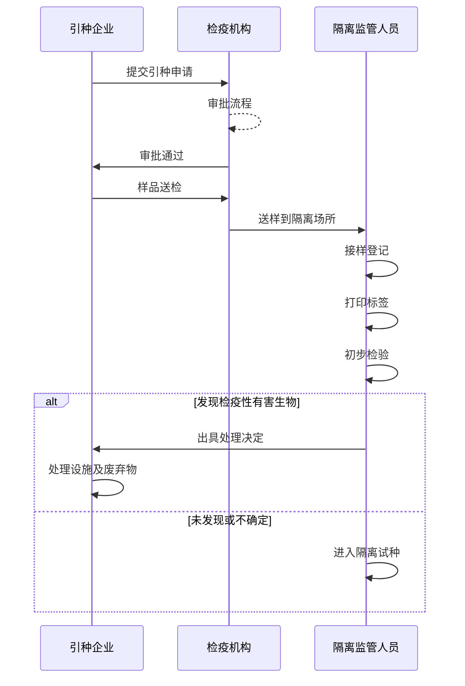

# 隔离试种管理

## 1. 功能概述

隔离试种管理模块是系统的核心业务功能，负责管理从样品接收到隔离试种完成的整个流程，包括样品接收、试种过程管理、检疫处理等功能。

## 2. 用户故事

### 2.1 隔离监管人员视角
作为隔离监管人员，我希望：
1. 能够规范地完成样品接收和登记
2. 能够有效地监控试种过程
3. 能够及时发现和处理问题
4. 能够完整记录全过程数据

### 2.2 检疫机构人员视角
作为检疫机构人员，我希望：
1. 能够及时了解隔离试种进展
2. 能够快速响应异常情况
3. 能够方便地查看历史记录
4. 能够生成规范的检疫文书

### 2.3 引种企业视角
作为引种企业，我希望：
1. 能够了解隔离试种进度
2. 能够及时获知检疫结果
3. 能够方便地查看相关文件
4. 能够快速处理问题反馈

## 3. 详细流程

### 3.1 样品接收流程
1. 预约送样
   - 企业提交送样申请
   - 确认送样时间
   - 准备接收条件
   - 通知相关人员

2. 样品核验
   - 检查随行单据
   - 核对样品信息
   - 检查包装状态
   - 记录接收情况

3. 初步检验
   - 外观检查
   - 记录异常情况
   - 采集样品照片
   - 出具检验意见

### 3.2 试种管理流程
1. 试种准备
   - 制定试种方案
   - 准备种植场地
   - 记录环境数据
   - 建立档案信息

2. 日常监管
   - 定期巡查记录
   - 环境数据采集
   - 生长状况记录
   - 异常情况处理

3. 问题处理
   - 发现问题记录
   - 评估危害程度
   - 制定处理方案
   - 跟踪处理结果

### 3.3 检疫处理流程
1. 结果评估
   - 收集监测数据
   - 分析检验结果
   - 评估检疫风险
   - 提出处理建议

2. 处理执行
   - 制定处理方案
   - 准备处理设施
   - 执行处理措施
   - 记录处理过程

3. 结果确认
   - 检查处理效果
   - 复检确认
   - 生成处理报告
   - 归档相关资料

## 4. 业务流程

### 4.1 样品接收流程



### 4.2 数据模型

```typescript
// 隔离试种记录
interface IsolationRecord {
  id: string;
  registrationNo: string; // 登记号
  enterprise: {
    id: string;
    name: string;
    address: string;
    contact: string;
    phone: string;
  };
  plant: {
    chineseName: string;
    scientificName: string;
    variety: string;
    part: string;
    sourceCountry: string;
    entryPort: string;
    entryQuantity: number;
    entryDate: string;
    sampleQuantity: number;
    packageMaterial: string;
  };
  approvalInfo: {
    approvalNo: string;
    quarantineCertNo: string;
    releaseNoticeNo: string;
    needRiskAnalysis: boolean;
  };
  facility: {
    id: string;
    name: string;
  };
  status: 'REGISTERED' | 'EXAMINING' | 'ISOLATING' | 'PROCESSING' | 'COMPLETED' | 'TERMINATED';
  createdAt: string;
  updatedAt: string;
}

// 检验记录
interface ExaminationRecord {
  id: string;
  isolationId: string;
  type: 'PRELIMINARY' | 'LABORATORY';
  examiner: {
    id: string;
    name: string;
  };
  examinationDate: string;
  method: string;
  result: string;
  findings: Array<{
    name: string;
    level: string;
    description: string;
  }>;
  conclusion: string;
  attachments?: Array<{
    id: string;
    name: string;
    url: string;
  }>;
  createdAt: string;
  updatedAt: string;
}

// 处理记录
interface ProcessingRecord {
  id: string;
  isolationId: string;
  noticeNo: string; // 处理决定通知书编号
  processor: {
    id: string;
    name: string;
  };
  processingDate: string;
  method: 'DESTROY' | 'STERILIZE' | 'DETOXIFY';
  quantity: number;
  result: string;
  attachments?: Array<{
    id: string;
    name: string;
    url: string;
  }>;
  createdAt: string;
  updatedAt: string;
}

// 观察记录
interface ObservationRecord {
  id: string;
  isolationId: string;
  observer: {
    id: string;
    name: string;
  };
  observationDate: string;
  growthStatus: string;
  symptoms: string;
  photos?: Array<{
    id: string;
    url: string;
    description: string;
  }>;
  remarks?: string;
  createdAt: string;
  updatedAt: string;
}
```

## 5. 功能设计

### 5.1 样品接收管理

1. 接样登记
   - 扫描抽样记录表二维码自动填充信息
   - 手动填写补充信息
   - 生成唯一登记号
   - 上传附件资料

2. 标签打印
   - 生成样品标签
   - 支持批量打印
   - 包含二维码

3. 初步检验
   - 记录检验方法和结果
   - 上传检验照片
   - 生成检验报告

### 5.2 隔离试种管理

1. 试种计划
   - 制定试种计划
   - 设置观察周期
   - 设置提醒

2. 观察记录
   - 记录生长状况
   - 记录症状观察
   - 上传观察照片
   - 设置异常提醒

3. 实验室检验
   - 登记检验样品
   - 记录检验过程
   - 生成检验报告

### 5.3 检疫处理管理

1. 处理决定
   - 生成处理决定通知书
   - 选择处理方式
   - 记录处理过程

2. 处理报告
   - 生成处理报告
   - 上传处理照片
   - 记录处理结果

3. 放行管理
   - 生成检疫放行证书
   - 生成疫情监测报告

## 6. 接口定义

### 6.1 样品接收接口

```typescript
// 接样登记
POST /api/isolation-records
Request: {
  registrationInfo: Omit<IsolationRecord, 'id' | 'status' | 'createdAt' | 'updatedAt'>;
  attachments?: Array<{
    name: string;
    file: File;
  }>;
}
Response: IsolationRecord

// 获取样品标签
GET /api/isolation-records/:id/label
Response: {
  html: string; // 标签HTML
  qrCode: string; // 二维码数据
}

// 提交初步检验
POST /api/isolation-records/:id/preliminary-examination
Request: Omit<ExaminationRecord, 'id' | 'type' | 'createdAt' | 'updatedAt'>
Response: ExaminationRecord
```

### 6.2 试种管理接口

```typescript
// 创建试种计划
POST /api/isolation-records/:id/plan
Request: {
  startDate: string;
  endDate: string;
  observationCycle: number;
  reminders: Array<{
    type: string;
    timing: string;
  }>;
}
Response: {
  success: boolean;
  plan: object;
}

// 提交观察记录
POST /api/isolation-records/:id/observations
Request: Omit<ObservationRecord, 'id' | 'createdAt' | 'updatedAt'>
Response: ObservationRecord

// 获取观察记录列表
GET /api/isolation-records/:id/observations
Query: {
  startDate?: string;
  endDate?: string;
  page: number;
  pageSize: number;
}
Response: {
  total: number;
  items: ObservationRecord[];
}

// 提交实验室检验
POST /api/isolation-records/:id/laboratory-examination
Request: Omit<ExaminationRecord, 'id' | 'type' | 'createdAt' | 'updatedAt'>
Response: ExaminationRecord
```

### 6.3 处理管理接口

```typescript
// 创建处理决定
POST /api/isolation-records/:id/processing-decisions
Request: {
  noticeNo: string;
  method: ProcessingRecord['method'];
  quantity: number;
  reason: string;
}
Response: {
  success: boolean;
  decision: object;
}

// 提交处理记录
POST /api/isolation-records/:id/processing-records
Request: Omit<ProcessingRecord, 'id' | 'createdAt' | 'updatedAt'>
Response: ProcessingRecord

// 生成放行证书
POST /api/isolation-records/:id/release-certificate
Request: {
  certificateNo: string;
  conclusion: string;
  remarks?: string;
}
Response: {
  success: boolean;
  certificate: object;
}
```

## 7. 数据库设计

```sql
-- 隔离试种记录表
CREATE TABLE isolation_records (
  id VARCHAR(36) PRIMARY KEY,
  registration_no VARCHAR(50) UNIQUE NOT NULL,
  enterprise_id VARCHAR(36) NOT NULL,
  plant_chinese_name VARCHAR(100) NOT NULL,
  plant_scientific_name VARCHAR(100),
  plant_variety VARCHAR(100),
  plant_part VARCHAR(50),
  source_country VARCHAR(50) NOT NULL,
  entry_port VARCHAR(50),
  entry_quantity DECIMAL(10,2) NOT NULL,
  entry_date DATE NOT NULL,
  sample_quantity DECIMAL(10,2) NOT NULL,
  package_material VARCHAR(100),
  approval_no VARCHAR(50) NOT NULL,
  quarantine_cert_no VARCHAR(50),
  release_notice_no VARCHAR(50),
  need_risk_analysis BOOLEAN DEFAULT false,
  facility_id VARCHAR(36) NOT NULL,
  status VARCHAR(20) NOT NULL,
  created_at TIMESTAMP NOT NULL DEFAULT CURRENT_TIMESTAMP,
  updated_at TIMESTAMP NOT NULL DEFAULT CURRENT_TIMESTAMP ON UPDATE CURRENT_TIMESTAMP
);

-- 检验记录表
CREATE TABLE examination_records (
  id VARCHAR(36) PRIMARY KEY,
  isolation_id VARCHAR(36) NOT NULL,
  type VARCHAR(20) NOT NULL,
  examiner_id VARCHAR(36) NOT NULL,
  examination_date DATE NOT NULL,
  method TEXT NOT NULL,
  result TEXT NOT NULL,
  conclusion TEXT NOT NULL,
  created_at TIMESTAMP NOT NULL DEFAULT CURRENT_TIMESTAMP,
  updated_at TIMESTAMP NOT NULL DEFAULT CURRENT_TIMESTAMP ON UPDATE CURRENT_TIMESTAMP
);

-- 检验发现表
CREATE TABLE examination_findings (
  id VARCHAR(36) PRIMARY KEY,
  examination_id VARCHAR(36) NOT NULL,
  name VARCHAR(100) NOT NULL,
  level VARCHAR(20) NOT NULL,
  description TEXT,
  created_at TIMESTAMP NOT NULL DEFAULT CURRENT_TIMESTAMP
);

-- 处理记录表
CREATE TABLE processing_records (
  id VARCHAR(36) PRIMARY KEY,
  isolation_id VARCHAR(36) NOT NULL,
  notice_no VARCHAR(50) NOT NULL,
  processor_id VARCHAR(36) NOT NULL,
  processing_date DATE NOT NULL,
  method VARCHAR(20) NOT NULL,
  quantity DECIMAL(10,2) NOT NULL,
  result TEXT NOT NULL,
  created_at TIMESTAMP NOT NULL DEFAULT CURRENT_TIMESTAMP,
  updated_at TIMESTAMP NOT NULL DEFAULT CURRENT_TIMESTAMP ON UPDATE CURRENT_TIMESTAMP
);

-- 观察记录表
CREATE TABLE observation_records (
  id VARCHAR(36) PRIMARY KEY,
  isolation_id VARCHAR(36) NOT NULL,
  observer_id VARCHAR(36) NOT NULL,
  observation_date DATE NOT NULL,
  growth_status TEXT NOT NULL,
  symptoms TEXT,
  remarks TEXT,
  created_at TIMESTAMP NOT NULL DEFAULT CURRENT_TIMESTAMP,
  updated_at TIMESTAMP NOT NULL DEFAULT CURRENT_TIMESTAMP ON UPDATE CURRENT_TIMESTAMP
);

-- 附件表
CREATE TABLE attachments (
  id VARCHAR(36) PRIMARY KEY,
  related_id VARCHAR(36) NOT NULL,
  related_type VARCHAR(50) NOT NULL,
  name VARCHAR(255) NOT NULL,
  url VARCHAR(255) NOT NULL,
  description TEXT,
  created_at TIMESTAMP NOT NULL DEFAULT CURRENT_TIMESTAMP
);
```

## 8. 注意事项

1. 业务规则
   - 登记号生成规则遵循规范
   - 处理决定需要5个工作日内确认
   - 复检期限为20个工作日

2. 数据完整性
   - 关键流程数据不可删除
   - 状态变更需要记录历史
   - 文件存储需要备份

3. 性能优化
   - 大量图片的存储和访问优化
   - 历史数据的归档策略
   - 报表生成的性能优化

## 9. 页面路径

1. 样品接收页面
   - 路径: `/isolation/samples`
   - 文件: `src/app/isolation/samples/page.tsx`
   - 功能: 样品接收登记、查询等操作

2. 试种管理页面
   - 路径: `/isolation/plants`
   - 文件: `src/app/isolation/plants/page.tsx`
   - 功能: 试种过程记录、进度跟踪等操作

3. 检疫处理页面
   - 路径: `/isolation/quarantine`
   - 文件: `src/app/isolation/quarantine/page.tsx`
   - 功能: 检疫处理记录、结果登记等操作 