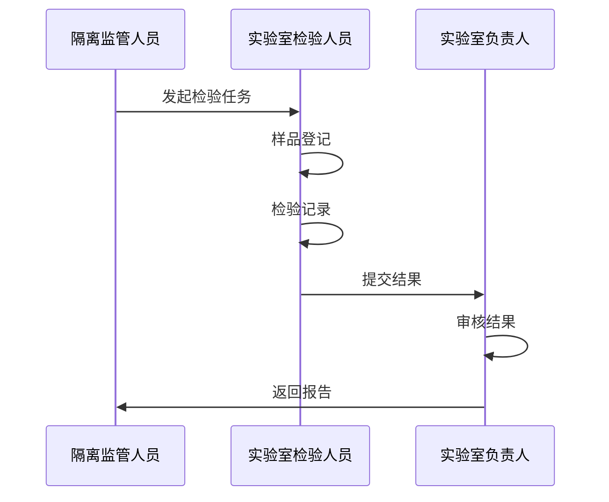

# 实验室检验管理

## 1. 功能概述

实验室检验管理模块负责管理隔离试种过程中的实验室检验工作，主要包括样品登记、检验记录、结果审核和报告生成。

## 2. 用户故事

### 2.1 隔离监管人员视角
作为隔离监管人员，我希望：
1. 能够及时发起实验室检验请求
2. 能够了解检验进度
3. 能够查看检验结果

### 2.2 实验室检验人员视角
作为实验室检验人员，我希望：
1. 能够了解检验要求
2. 能够记录检验过程
3. 能够提交检验结果

### 2.3 实验室负责人视角
作为实验室负责人，我希望：
1. 能够分配检验任务
2. 能够审核检验结果
3. 能够生成检验报告

## 3. 业务流程



## 4. 数据模型

```typescript
// 检验任务
interface LaboratoryTask {
  id: string;
  isolationId: string;
  sampleInfo: {
    name: string;
    type: string;
    quantity: number;
    unit: string;
    collectionDate: string;
  };
  assignee?: {
    id: string;
    name: string;
  };
  status: 'PENDING' | 'IN_PROGRESS' | 'COMPLETED';
  createdAt: string;
  updatedAt: string;
}

// 检验结果
interface TestResult {
  id: string;
  registrationNo: string; // 登记号
  approvalNo: string; // 审批编号
  plantName: string; // 植物中名
  sampleInfo: {
    sampleNo: string; // 样品编号
    part: string; // 取样部位
    quantity: number; // 取样数量
    unit: string; // 单位
    samplingDate: string; // 取样时间
    sampler: {
      id: string;
      name: string;
    };
    submissionDate: string; // 送检时间
  };
  inspector: {
    id: string;
    name: string;
  };
  inspectionDate: string;
  method: string;
  findings: Array<{
    type: string;
    description: string;
  }>;
  conclusion: 'PASS' | 'FAIL' | 'NEED_PROCESS';
  attachments?: Array<{
    id: string;
    url: string;
  }>;
  reviewStatus: 'PENDING' | 'APPROVED' | 'REJECTED';
  reviewer?: {
    id: string;
    name: string;
    comments?: string;
  };
  createdAt: string;
  updatedAt: string;
}
```

## 5. 功能设计

### 5.1 样品登记
1. 基本信息
   - 样品来源
   - 样品类型
   - 样品数量

2. 检验分配
   - 选择检验人员
   - 设置检验要求

### 5.2 检验记录
1. 过程记录
   - 检验方法
   - 检验发现
   - 结论判定

2. 结果审核
   - 提交审核
   - 审核确认
   - 生成报告

## 6. 接口定义

```typescript
// 任务列表
GET /api/laboratory/tasks
Query: {
  status?: LaboratoryTask['status'];
  page: number;
  pageSize: number;
}
Response: {
  total: number;
  items: LaboratoryTask[];
}

// 创建任务
POST /api/laboratory/tasks
Request: Omit<LaboratoryTask, 'id' | 'status' | 'createdAt' | 'updatedAt'>
Response: LaboratoryTask

// 提交检验结果
POST /api/laboratory/tasks/:id/results
Request: Omit<TestResult, 'id' | 'taskId' | 'reviewStatus' | 'reviewer' | 'createdAt' | 'updatedAt'>
Response: TestResult

// 审核结果
POST /api/laboratory/tasks/:id/results/:resultId/review
Request: {
  approved: boolean;
  comments?: string;
}
Response: TestResult
```

## 7. 数据库设计

```sql
-- 检验任务表
CREATE TABLE laboratory_tasks (
  id VARCHAR(36) PRIMARY KEY,
  isolation_id VARCHAR(36) NOT NULL,
  sample_name VARCHAR(100) NOT NULL,
  sample_type VARCHAR(50) NOT NULL,
  sample_quantity DECIMAL(10,2) NOT NULL,
  sample_unit VARCHAR(20) NOT NULL,
  collection_date DATE NOT NULL,
  assignee_id VARCHAR(36),
  status VARCHAR(20) NOT NULL DEFAULT 'PENDING',
  created_at TIMESTAMP NOT NULL DEFAULT CURRENT_TIMESTAMP,
  updated_at TIMESTAMP NOT NULL DEFAULT CURRENT_TIMESTAMP ON UPDATE CURRENT_TIMESTAMP
);

-- 检验结果表
CREATE TABLE test_results (
  id VARCHAR(36) PRIMARY KEY,
  task_id VARCHAR(36) NOT NULL,
  inspector_id VARCHAR(36) NOT NULL,
  inspection_date DATE NOT NULL,
  method TEXT NOT NULL,
  findings JSON NOT NULL,
  conclusion VARCHAR(20) NOT NULL,
  attachments JSON,
  review_status VARCHAR(20) NOT NULL DEFAULT 'PENDING',
  reviewer_id VARCHAR(36),
  reviewer_comments TEXT,
  created_at TIMESTAMP NOT NULL DEFAULT CURRENT_TIMESTAMP,
  updated_at TIMESTAMP NOT NULL DEFAULT CURRENT_TIMESTAMP ON UPDATE CURRENT_TIMESTAMP
);
```

## 8. 注意事项

1. 业务规则
   - 检验流程规范
   - 结果审核必要
   - 数据可追溯

2. 数据安全
   - 记录完整性
   - 修改可追踪

3. 性能优化
   - 附件存储
   - 查询优化 